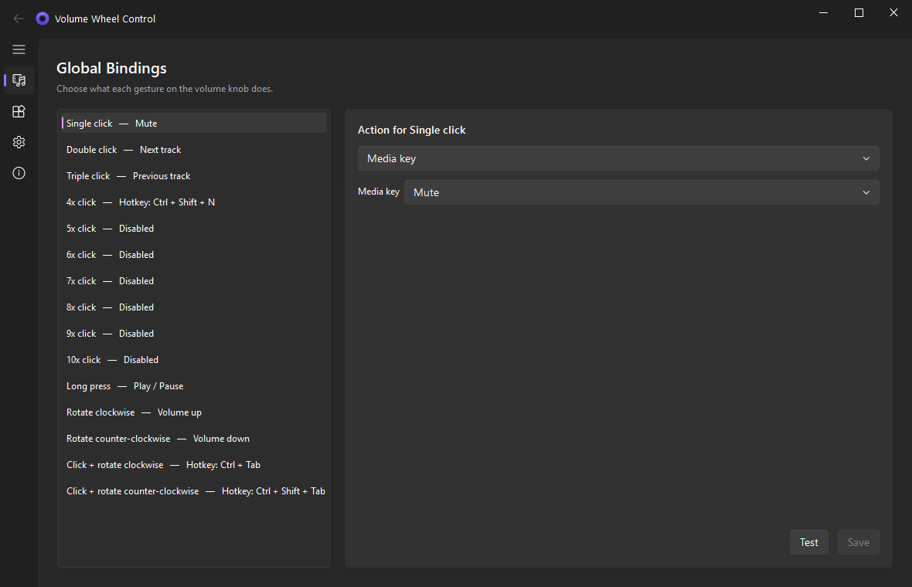
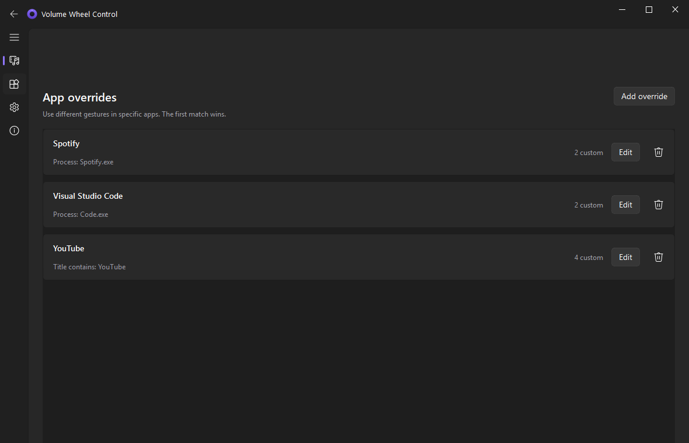
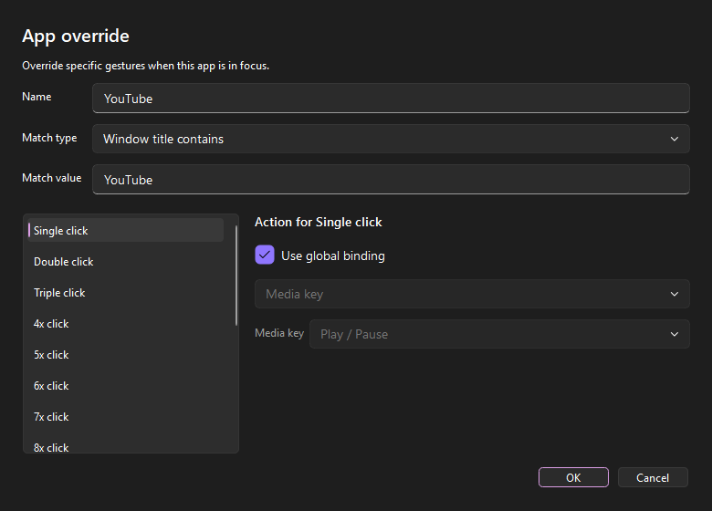
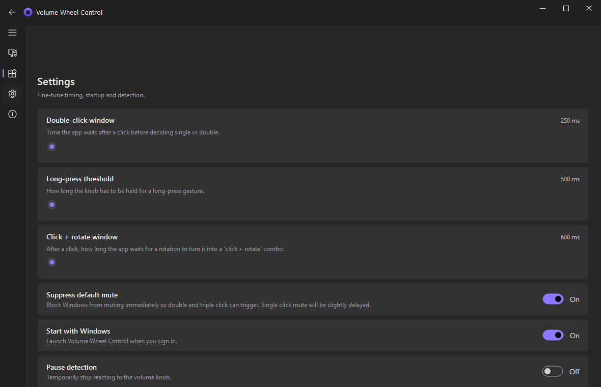

<p align="center">
   
</p>

<h1 align="center">Volume Wheel Control</h1>

<p align="center">
  <a href="LICENSE"></a>
  <a href="https://www.python.org/downloads/"></a>
  
  
  
  
</p>

Programmable macros for keyboard volume knobs on Windows. Originally built for the Ajazz AK820, works with any keyboard that emits standard `Volume Up`, `Volume Down` and `Volume Mute` events.

Turn your knob into a real productivity input device. Map clicks, long presses and rotation to media keys, keyboard shortcuts, app launchers or window actions. Define different macros per application.



## Highlights

- **15 distinct gestures** out of the box — single, double, triple click up to 10x click, long press, rotation, and **click + rotate combos**.
- **Per-app overrides** on top of a global profile. Skip tracks in Spotify, change tabs in VS Code, scrub through YouTube with the same knob.
- **Five action types** — send media keys, trigger keyboard shortcuts, launch programs, minimize/maximize/switch windows, or explicitly disable a gesture.
- **Low-level keyboard hook** written in C via `ctypes` — reliable suppression of the default mute so double click actually works, no timing races.
- **Works with any keyboard** that exposes `Volume Up` / `Volume Down` / `Volume Mute`. No vendor driver required.
- **Hot reload** — edit bindings in the UI, click Save, the running hook picks up the new config without restart.
- **Runs in the tray**, starts with Windows, zero CLI.

## Screenshots

### Global bindings


Every gesture appears as a row with its current binding on the side. The editor on the right changes based on the selected action type. `Test` fires the action right from the editor.

### Per-app overrides



Define overrides per process name, window title (exact substring) or a regex on the title. First match wins, each override only needs to specify gestures it wants to change — the rest fall back to the global profile.

### Override editor



### Settings



Fine-tune the timing of double click, long press and the click + rotate combo window. Toggle autostart, pause detection, open the config folder.

## Installing

### Option 1: Prebuilt executable

Grab `VolumeWheelControl.exe` from the [Releases](../../releases) page. Single-file, no Python required, no admin rights needed for normal use.

### Option 2: From source

Requires Python 3.10 or newer on Windows 10 / 11.

```bash
git clone https://github.com/kubapelc/VolumeWheelControl.git
cd VolumeWheelControl
python -m pip install -e .
python -m volume_wheel_control
```

To build your own executable:

```bash
python -m pip install -e ".[dev]"
python build.py
```

Output: `dist/VolumeWheelControl.exe` (compiled with Nuitka).

## Gestures

| Gesture | When it fires |
|---|---|
| Single click | Knob pressed and released, no follow-up click within ~250 ms |
| Double click | Two presses within the double-click window |
| Triple click | Three presses |
| 4x through 10x click | More presses, detected up to ten |
| Long press | Held for at least ~500 ms |
| Rotate clockwise / counter-clockwise | One turn step |
| Click + rotate clockwise / counter-clockwise | A press followed by rotation within the combo window (~600 ms) |

All timings are configurable in Settings.

## Action types

| Type | What it does |
|---|---|
| Media key | Sends one of the standard media keys: Play/Pause, Next, Previous, Stop, Mute, Volume Up/Down |
| Hotkey | Fires a keyboard shortcut you capture by pressing it (e.g. `Ctrl+Right`, `Win+D`) |
| Run program | Launches an executable or opens a file, with optional arguments and working directory |
| Window action | Minimize, maximize, restore, close, show desktop, switch next/previous window, toggle fullscreen |
| Disabled | Explicitly do nothing — useful to suppress a gesture without falling back to global |

## How the mute delay works

Pressing the knob normally mutes the system instantly. To reliably detect a double click, the app blocks the hardware mute event and waits for the configured double-click window (default 250 ms). If no second click arrives, `Mute` is sent; otherwise the double / triple / N-click action fires instead.

If you want the mute to be instant and you don't need multi-click or long press on the knob, turn off `Suppress default mute` in Settings.

## Configuration

Saved to `%APPDATA%\VolumeWheelControl\config.json`. You can edit it by hand and pick `Reload config` from the tray menu. Schema versions are migrated forward automatically.

```json
{
  "version": 2,
  "settings": {
    "double_click_timeout_ms": 250,
    "long_press_threshold_ms": 500,
    "hold_rotate_window_ms": 600,
    "start_with_windows": true,
    "suppress_default_actions": true
  },
  "global_profile": {
    "bindings": {
      "single_click": { "type": "media", "key": "mute" },
      "double_click": { "type": "media", "key": "next_track" },
      "hold_rotate_up": { "type": "hotkey", "keys": "ctrl+tab" }
    }
  },
  "app_overrides": [
    {
      "name": "Spotify",
      "match": { "type": "process", "value": "Spotify.exe" },
      "bindings": {
        "double_click": { "type": "hotkey", "keys": "ctrl+right" }
      }
    }
  ]
}
```

## How it works

- A low-level Windows keyboard hook (`SetWindowsHookExW` with `WH_KEYBOARD_LL`) runs on a dedicated thread with a proper message loop.
- Raw events are marshalled to the Qt main thread through a queued signal, then fed into a small gesture state machine.
- Bindings are resolved against the active foreground window (polled via `GetForegroundWindow` + `psutil`) with app overrides tried in order.
- Actions execute on a worker pool so a slow `Run program` action never stalls the hook.
- Output events are sent via `SendInput` tagged with a private `dwExtraInfo` value so the hook can distinguish them from physical knob events and avoid feedback loops.

## Developing

Tests cover the gesture state machine, the profile resolver, config storage and migrations, and the matchers. No Windows APIs are touched in CI.

```bash
python -m pytest
```

Stack:

- Python 3.10+
- PyQt6 + qfluentwidgets for the GUI
- Pydantic for the config schema
- `ctypes` for the keyboard hook, `pywin32` for foreground window and registry autostart
- Nuitka for packaging

## License

MIT. See [LICENSE](LICENSE).
